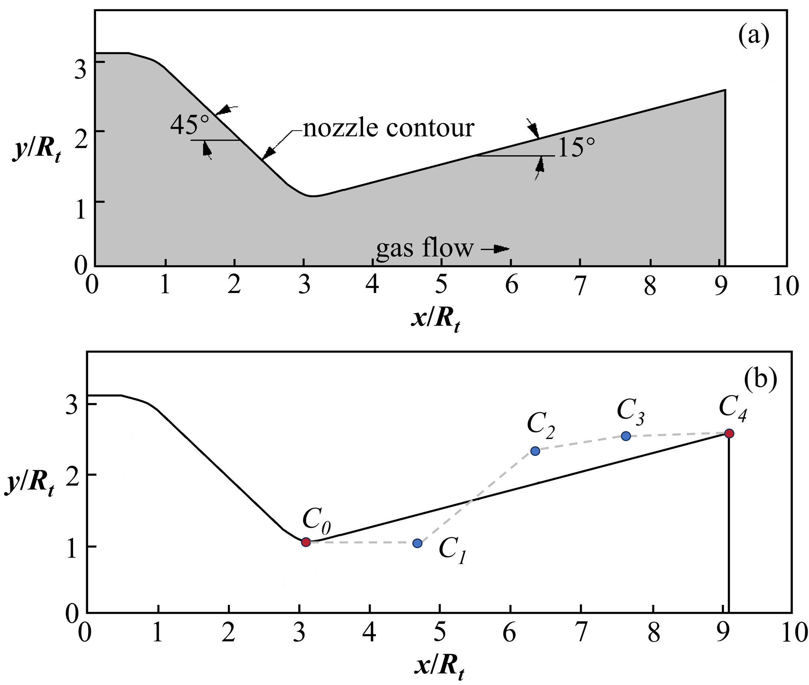
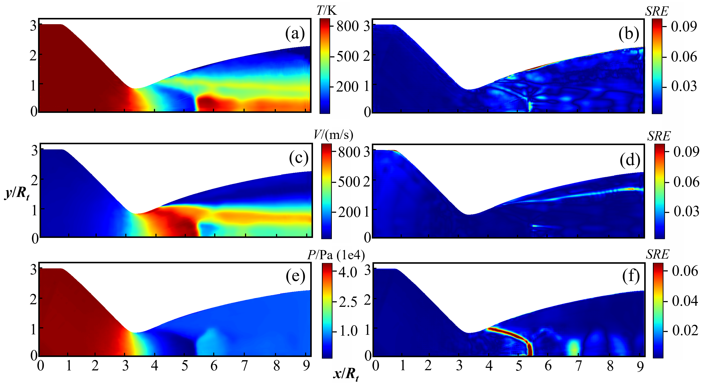
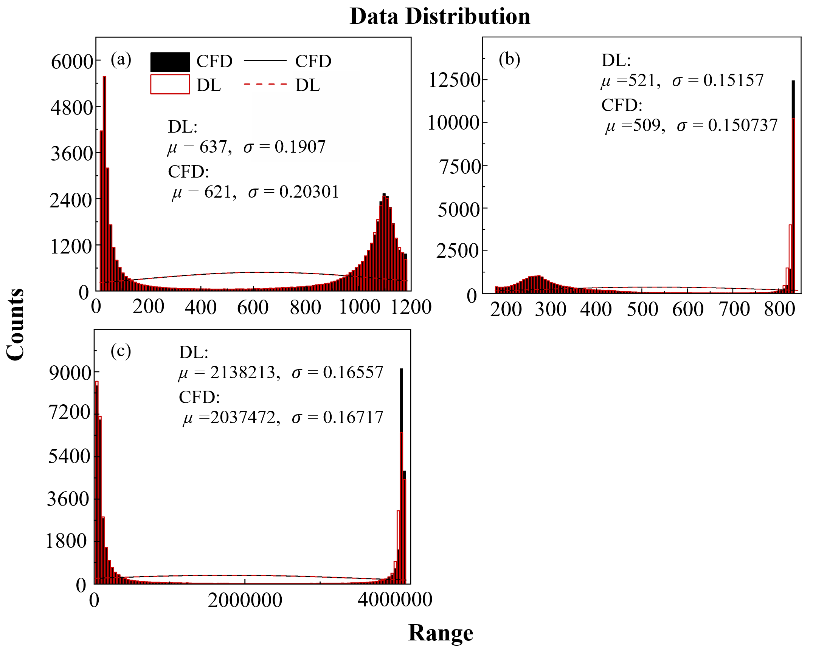
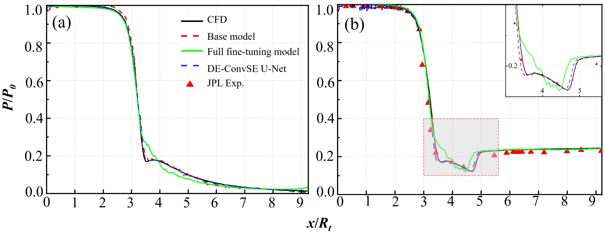

# Dual-End-Convolutional-Squeeze-Excitation-Adapters-U-Net-for-Prediction-of-Flow-Fields-of-Nozzles
This repository contains the implementation of the paper: **"Incremental Learning for Flow Field Reconstruction in Variable-Geometry Nozzles"**(Under Review).

We propose a DE-ConvSE Adapter U-Net for rapid nozzle flow prediction, in whicha U-Net backbone is augmented with Dual-End Convolutional Squeeze-and-Excitation adapters. 
The network integrates geometric topology encoding and boundary condition mapping to accurately reconstruct velocity, pressure, andtemperature distributions. 
To enable efficient adaptation to previously unseen nozzle geometries, an adapter-basedincremental learning strategy is introduced, where the pretrained backbone is frozen and only a small set of adapter parameters is updated. 
This strategy substantially improves the generalization capability of the model while maintaining high computational efficiency and mitigating catastrophic forgetting. Validation on a convergent–divergent nozzle benchmark demonstrates that the proposed approach achieves high reconstruction accuracy, 
with maximum symmetric relative errors below 9.14% and mean absolute errors below 5.21%. Compared with CFD solvers, the proposed method is mesh-free and provides orders-of-magnitude acceleration, highlighting its potential for real-time flow prediction and
design optimization in advanced fluid dynamic systems.

## 🚀 Key Features

* **DE-ConvSE Adapter U-Net:** A U-Net backbone augmented with Dual-End Convolutional Squeeze-and-Excitation adapters.
* **Incremental Learning:** Freezes the backbone and updates only the adapters to adapt to new geometries efficiently.
* **Geometry-Aware Inputs:** Utilizes Signed Distance Fields (SDF) and Identifier Matrices (IM) to encode boundary conditions.
* **High Performance:**
    * **Speedup:** >300x faster than traditional CFD solvers.
    * **Accuracy:** Max Symmetric Relative Error (SRE) < 9.14%, and Mean Absolute Errors (MAE) below 5.21%

## 🛠️ Model Architecture

## 📂 Dataset Preparation
The nozzle configuration developed by the Jet Propulsion Laboratory (JPL) is adopted as the reference geometry.

The dataset consists of nozzle geometries parameterized by Bézier curves and their corresponding CFD flow fields (Temperature, Velocity, Pressure).

* **Inputs:** Signed Distance Field (SDF) and Identifier Matrix (IM).

 In this convention, the points inside the nozzle have positive values, the points outside have negative values, and the points located exactly on the wall are 0.

.png)

The identifier matrix assigns values of 0 to the region outside the nozzle, 1 to the internal flow region, 2 to the inlet, 3 to the outlet, 4 to the boundary of axis and 5 to the contour of the nozzle.

.png)
* **Outputs:** Flow field images/tensors.

## 🏃 Usage

* **Train the Base Model**
*  **Incremental Learning (Adapter Tuning):**Freeze the backbone and train the DE-ConvSE adapters on a small set of new geometries (e.g., 30 samples).

## 📊 Results

## 📧 Contact
Since our paper is currently under review, the detailed code and dataset will be uploaded after the paper is accepted. If you need the code and dataset recently, please contact us:Jinheng Yang: 124101022118@njust.edu.cn

